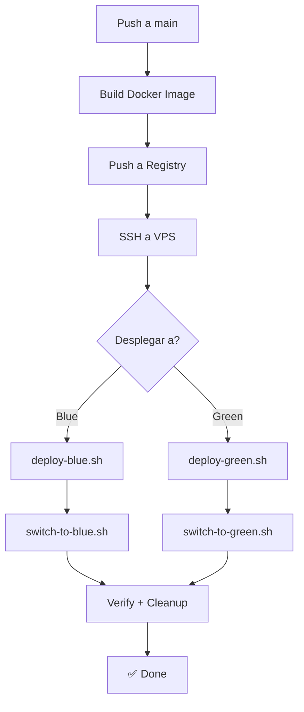

# 🚀 Blue-Green Deployment Project

Sistema completo de despliegue Blue-Green con CI/CD usando Docker, Nginx y GitHub Actions.

## 📋 Descripción General

Este proyecto implementa una estrategia de despliegue Blue-Green que permite:

- ✅ **Dos entornos simultáneos** (Blue y Green) en el mismo servidor
- ✅ **Cambio de tráfico sin downtime** mediante Nginx
- ✅ **Pipeline CI/CD automatizado** con GitHub Actions
- ✅ **Rollback inmediato** si es necesario
- ✅ **Health checks automáticos** para validar despliegues
- ✅ **Escalabilidad horizontal** con Docker

## 🏗️ Estructura del Proyecto

```
blue-green-deploy/
├── app/                          # Código de la aplicación
│   ├── Dockerfile                # Imagen Docker multietapa
│   ├── server.js                 # Servidor Express demo
│   └── package.json              # Dependencias Node.js
│
├── nginx/                        # Configuraciones de Nginx
│   ├── blue.conf                 # Config para entorno BLUE (puerto 3001)
│   ├── green.conf                # Config para entorno GREEN (puerto 3002)
│   └── service.template          # Template de configuración
│
├── scripts/                      # Scripts de despliegue y gestión
│   ├── deploy-blue.sh            # Desplegar a BLUE
│   ├── deploy-green.sh           # Desplegar a GREEN
│   ├── switch-to-blue.sh         # Activar tráfico en BLUE
│   ├── switch-to-green.sh        # Activar tráfico en GREEN
│   ├── docker-clean.sh           # Limpiar recursos Docker
│   └── setup-vps.sh              # Setup inicial del VPS
│
├── .github/workflows/            # Pipelines CI/CD
│   └── deploy.yml                # Pipeline principal
│
├── README.md                     # Este archivo
├── SETUP.md                      # Guía de instalación
├── DEPLOYMENT.md                 # Guía de despliegues
├── NGINX_CONFIG.md               # Detalles de Nginx
└── .gitignore                    # Archivos a ignorar en git
```

## 🔧 Requisitos Previos

### Servidor VPS
- Ubuntu 22.04 LTS o superior
- Acceso SSH con usuario con permisos sudo
- Nginx ya instalado y funcionando
- Dominio apuntando a la IP del servidor (ej: nueva-app.com)

### Máquina local
- Git
- SSH client configurado
- Permisos para push a repositorio

### Credenciales
- SSH private key para acceso al VPS
- GitHub account con permisos de push

## 🚀 Quick Start

### 1. Configurar VPS (una única vez)

Conectarse al VPS y ejecutar:

```bash
cd ~/blue-green-deploy
sudo chmod +x scripts/setup-vps.sh
sudo ./scripts/setup-vps.sh
```

Esto instalará:
- Docker y Docker Compose
- Dependencias necesarias
- Configuración de Nginx
- Directorios de logs

### 2. Copiar archivos de configuración

```bash
# En el VPS
cd ~/blue-green-deploy
sudo cp nginx/blue.conf /etc/nginx/conf.d/
sudo cp nginx/green.conf /etc/nginx/conf.d/
sudo cp nginx/blue.conf /etc/nginx/conf.d/service.conf  # Valor por defecto
sudo nginx -t  # Verificar sintaxis
sudo systemctl reload nginx
```

### 3. Realizar primer despliegue

```bash
# En el VPS
cd ~/blue-green-deploy
sudo ./scripts/deploy-blue.sh ghcr.io/usuario/tu-imagen:latest
sudo ./scripts/switch-to-blue.sh
```

### 4. Verificar

```bash
# Desde local o VPS
curl -H "Host: nueva-app.com" http://167.172.198.138
# O si está configurado en hosts local:
curl http://nueva-app.com
```

## 📦 Configurar GitHub Actions

### Secrets necesarios

En tu repositorio GitHub, agregar los siguientes secrets:

1. **VPS_HOST**: IP o dominio del VPS (ej: `167.172.198.138`)
2. **VPS_USER**: Usuario en el VPS (ej: `deployer`)
3. **VPS_KEY**: Contenido completo de tu clave SSH privada

```bash
# Para obtener el contenido de la clave:
cat ~/.ssh/id_ed25519
```

### Configurar Workflow

El pipeline se ejecutará automáticamente cuando:
- Hagas push a la rama `main`
- Cambies archivos en `app/`, `Dockerfile`, o `.github/workflows/deploy.yml`

O manualmente disparándolo desde Actions.

## 🔄 Flujo de Despliegue



## 📝 Comandos Principales

### En el VPS

```bash
# Desplegar a Blue
sudo ~/blue-green-deploy/scripts/deploy-blue.sh ghcr.io/usuario/imagen:latest

# Desplegar a Green
sudo ~/blue-green-deploy/scripts/deploy-green.sh ghcr.io/usuario/imagen:latest

# Cambiar tráfico a Blue
sudo ~/blue-green-deploy/scripts/switch-to-blue.sh

# Cambiar tráfico a Green
sudo ~/blue-green-deploy/scripts/switch-to-green.sh

# Limpiar recursos Docker
sudo ~/blue-green-deploy/scripts/docker-clean.sh

# Ver estado de contenedores
docker ps -a

# Ver logs de Nginx
sudo tail -f /var/log/nginx/blue-green-access.log

# Ver logs de despliegue
sudo tail -f /var/log/blue-green-deploy.log

# Verificar configuración Nginx
sudo nginx -t

# Recargar Nginx
sudo systemctl reload nginx
```

### Verificar estado

```bash
# Ver qué entorno está activo
cat /etc/nginx/blue-green-active

# Verificar health de Blue
curl http://127.0.0.1:3001/health

# Verificar health de Green
curl http://127.0.0.1:3002/health

# Verificar a través de Nginx
curl -H "Host: nueva-app.com" http://127.0.0.1
```

## 🔍 Arquitectura

```
Internet (usuarios)
    ↓
 [Nginx - Reverse Proxy]
    ↓
  [switch-to-blue.sh o switch-to-green.sh]
    ↓            ↓
  [Blue]      [Green]
  :3001       :3002
  Docker      Docker
  Container   Container
```

### Puertos utilizados

- **80**: Nginx (tráfico público)
- **3001**: Aplicación Blue (interno)
- **3002**: Aplicación Green (interno)
- **22**: SSH (administración)

## 🧪 Testing

### Health Checks

La aplicación expone endpoints de salud:

```bash
# Estado básico
curl http://127.0.0.1:3001/health
# Respuesta: {"status":"UP","timestamp":"...","environment":"BLUE"}

# Estado detallado
curl http://127.0.0.1:3001/status
# Respuesta: {...detalles técnicos...}
```

**Versión:** 1.0.0

**Estado:** ✅ Production Ready
